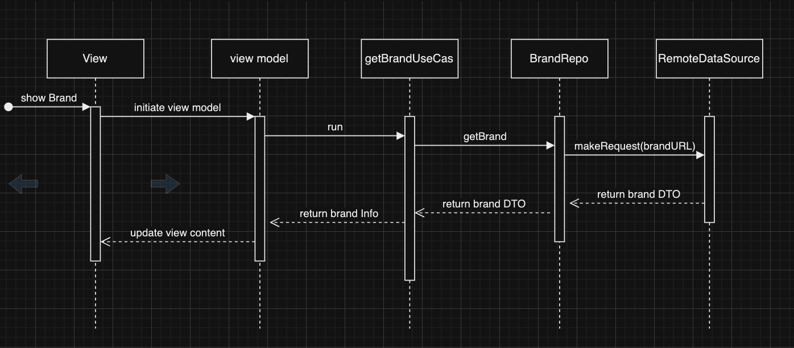

# Salla Challenge

## DI
in this project I used simple and clean DI, it's missing some features like create new objects in some places without reuse so I dont need to depend on the ViewModel to keep track for things, but it will do the work

## Product details
I used the same object I got from the brand details, I didnt see any difference the same image can't get more than one, I did the repo but for saving time I ignored it

## Testing
I went for TDD in first two features, after that I went without to save time

## Caching
I went for NSCache to cache the images

## Diagrams

### Get brad sequence diagram

### Get brad products sequence diagram
